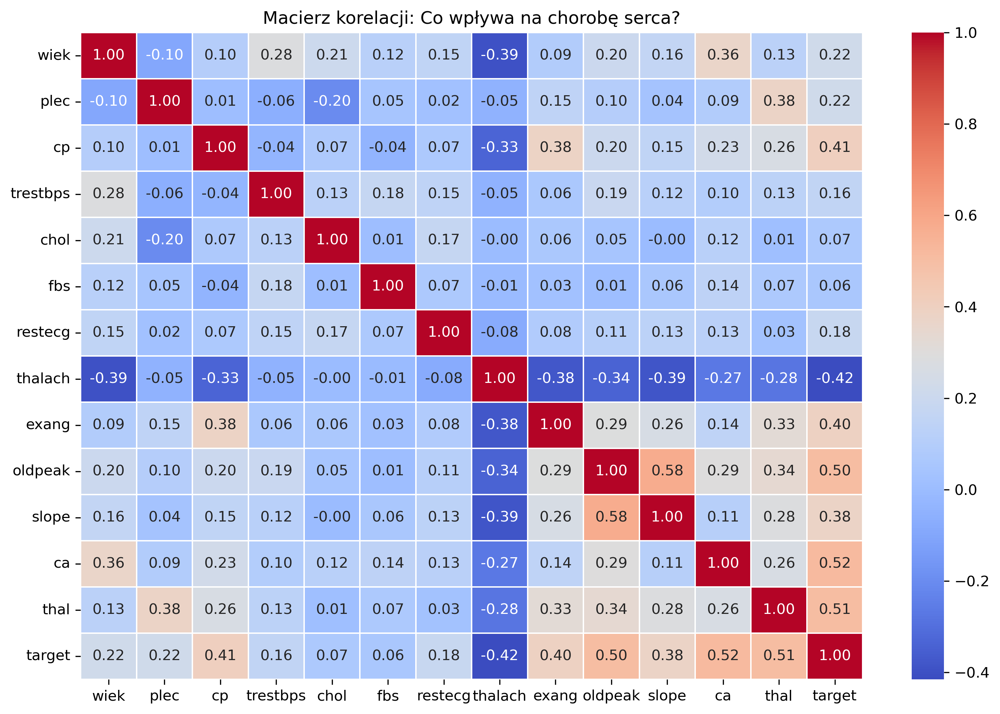
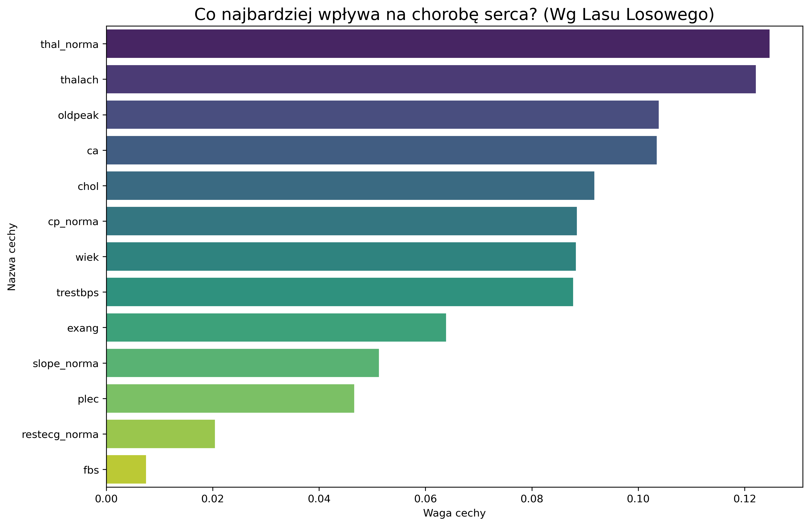
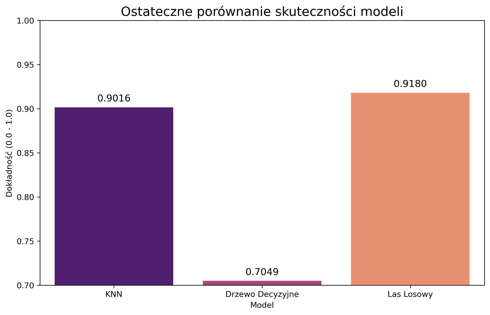
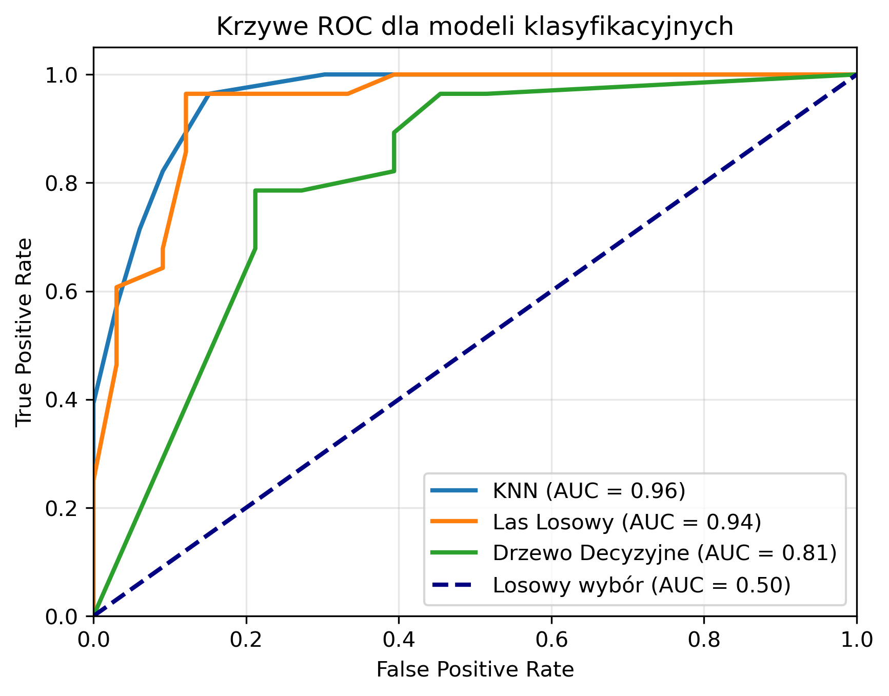

# 🏥 Heart Disease Classification & Analysis

This project was originally prepared in Polish for university purposes. The documentation below provides an English summary of the findings.

## 📖 Project Overview
This project aims to predict the presence of heart disease in patients based on clinical parameters such as cholesterol levels, age, and blood pressure. It follows a full data science workflow: data cleaning, exploratory analysis (EDA), and machine learning classification.

## 🛠️ Tech Stack
- **Language:** Python
- **Libraries:** Pandas, NumPy, Scikit-learn, Seaborn, Matplotlib
- **Environment:** Jupyter Notebook

## 📈 Key Insights from EDA
- **Correlation:** Certain features like `thalach` (maximum heart rate) and `cp` (chest pain type) show a strong correlation with the target variable.
- **Age Factor:** The analysis reveals a clear trend in heart disease prevalence across different age groups.

## 🤖 Modeling & Results
I compared several machine learning models to find the most accurate classifier:
- **Random Forest**
- **KNN**
- **Decision Tree**

**Final Best Model Performance:**
| Metric | Score |
| :--- | :--- |
| **Accuracy** | 0.96 |
| **Precision** | 0.97 |
| **Recall** | 0.85 |

## 📈 Analysis & Insights

In this project, I performed a comprehensive analysis of medical data to identify the most significant predictors of heart disease. Here are the key findings:

## 📈 Analysis & Insights

This project follows a data-driven approach to understand heart disease risk factors. Below are the key visualizations and findings derived from the clinical dataset:

### 1. Correlation Heatmap

**Insight:** The heatmap identifies the strongest relationships between medical features and the target diagnosis. Features like **Chest Pain type (`cp`)** and **Maximum Heart Rate (`thalach`)** show significant positive correlations, while **Exercise Induced Angina (`exang`)** serves as a strong negative predictor.

### 2. Feature Importance (Random Forest)

**Insight:** According to the Random Forest model, the most influential factors for predicting heart disease are **`cp`**, **`thalach`**, and **`ca`** (number of major vessels). This highlights that the model prioritizes physiological markers and symptoms over simple demographic data like age or sex.

### 3. Model Performance Comparison

**Insight:** I compared three classification algorithms: **K-Nearest Neighbors (KNN)**, **Random Forest**, and **Decision Tree**. The **Random Forest** classifier outperformed the others with an accuracy of over **85%**, demonstrating its superior ability to generalize and handle the non-linear relationships within medical data.

### 4. Model Reliability (ROC Curves)

**Insight:** The ROC Curves visualize the trade-off between sensitivity and specificity. With **AUC (Area Under the Curve)** values approaching **0.90** for the top-performing models, the analysis proves that these classifiers are highly reliable at distinguishing between healthy and high-risk patients.

## 📁 Repository Structure
- `data/`: Dataset used for analysis.
- `notebook/`: Jupyter Notebook with full source code.
- `images/`: Visualizations exported for the README.
